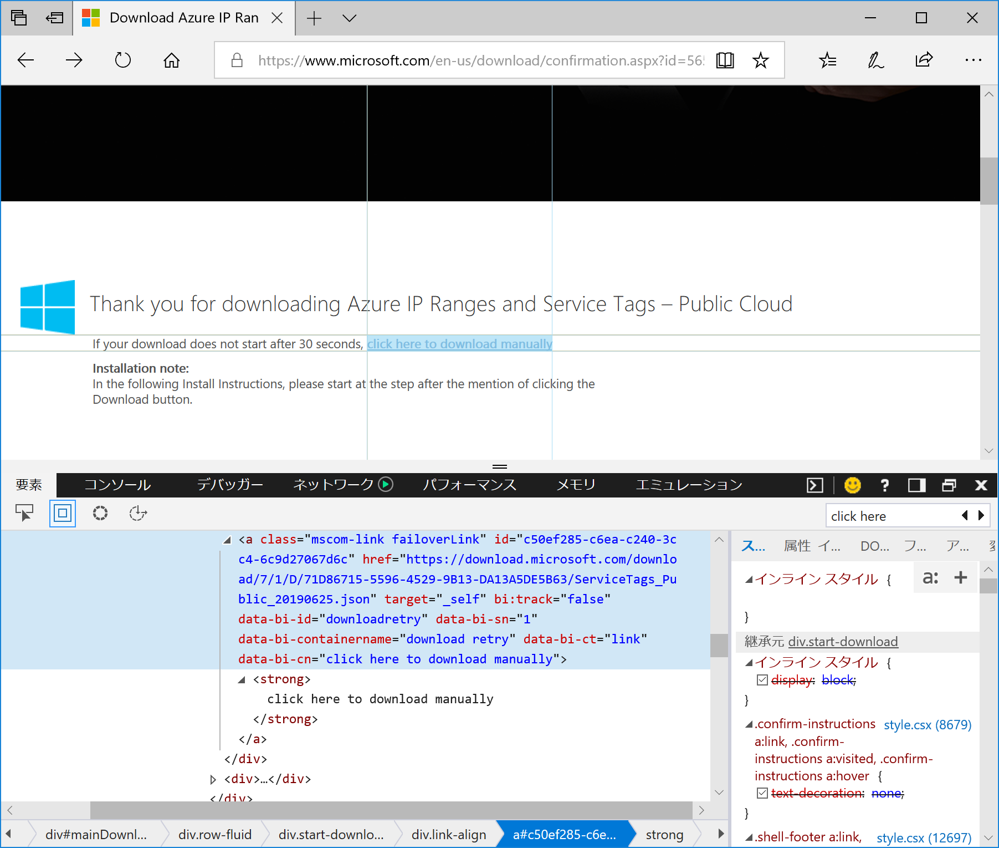

# THIS REPOSITORY WAS ARCHIVED

Should use official commands like below:
[Get-AzNetworkServiceTag](https://docs.microsoft.com/en-us/powershell/module/az.network/get-aznetworkservicetag?view=azps-8.0.0)


# Azure IP address and Service tags helper script

## How to use

List service tags of Public Azure: 
```
PS > .\azip.ps1 -list
```

Then retrieve ip adress ranges for whole japane east region, or AppServices only 
```
PS > .\azip.ps1 -service AzureCloud.japaneast
PS > .\azip.ps1 -service AppService.japaneast
```

If you want to get informations for other cloud, use `cloud` option.
```
PS > .\azip.ps1 -cloud germany -list
PS > .\azip.ps1 -cloud germany -service sql
PS > .\azip.ps1 -cloud germany -service storage.germancentral
```

If you need mode detail :
```pwsh
PS > help .\azip.ps1
```

## Specification

Azure Service tags and IP address ranges can be download from :

- [Public Cloud](https://www.microsoft.com/en-us/download/details.aspx?id=56519)
- [China Cloud](https://www.microsoft.com/en-us/download/details.aspx?id=57062)
- [US Goverment Cloud](https://www.microsoft.com/en-us/download/details.aspx?id=57063)
- [Germany Cloud](https://www.microsoft.com/en-us/download/details.aspx?id=57064)

This script downloads json file from confirmation pages with web scraping like below.



Then save and re-use downloaded json in daily manner.
If you want to clear cache, check the path with Verbose option.

```pwsh
PS > .\azip.ps1 -verbose  -service dummy

VERBOSE: tempolary file will be C:\Users\ayumu\AppData\Local\Temp\20190628_AzureServiceTags.Public.json
VERBOSE: cloud type : Public, change number : 78
WARNING: service dummy is not found
```
